# Final FCRA Bank Holdout Comparison

Run date: 2026-06-02

## Scope

This report compares only the final version of each approach on the 18-case,
90-disposition FCRA bank-furnisher holdout set.

- **Governed RuleKit**: final bank-furnisher artifact with perspective node
  overrides, profile defaults, governed Map records, deterministic engine
  execution, and the corrected false-result uncertainty override.
- **Direct LLM**: final profiled direct-disposition prompt, run once per case
  against Anthropic `claude-opus-4-7`.

The holdout cases are narrative-only. They test CRA-transmitted disputes,
direct furnisher disputes, wrong-address intake, insufficient direct packets,
public-record-only exceptions, identity-theft packets, mixed-file routing,
veteran medical-debt deletion, duplicate/no-new-info disputes, and dual-channel
CRA/direct intake.

## Artifacts

| Artifact | Path |
|---|---|
| Holdout cases | `rulekit/orchestrator/example_cases/fcra_bank_customer_disputes_eval.yaml` |
| Final governed program | `audits/fcra_bank_profile_v6/bank_furnisher_program.json` |
| Final governed replay | `audits/fcra_bank_holdout_eval/map_profile_v6_replay_v5_bindings_plus_defaults` |
| Governed live Map records used by replay | `audits/fcra_bank_holdout_eval/map_profile_v5` |
| Final direct run | `audits/fcra_bank_holdout_eval/direct_profiled_v2` |

## Final Result

| Approach | Cases | Dispositions | Matches | Mismatches | Accuracy | LLM calls | Estimated tokens | Latency |
|---|---:|---:|---:|---:|---:|---:|---:|---:|
| Governed RuleKit final | 18 | 90 | 89 | 1 | 98.89% | 16 Map calls reused, 0 replay calls | 222,694 for live Map, 0 replay | 347.49s live Map, replay n/a |
| Direct LLM final | 18 | 90 | 85 | 5 | 94.44% | 18 disposition calls | 206,490 | 361.88s |

The governed final row is measured by replaying the v5 live Map records through
the final v6 program/profile/evaluation logic. That means the reported governed
accuracy is the final artifact behavior on the already-recorded live Map
bindings. It did not spend a new LLM run after the final deterministic fixes.

## Final Mismatch Direction

Governed RuleKit final:

| Actual | Expected | Count |
|---|---|---:|
| `false` | `undetermined` | 1 |

Direct LLM final:

| Actual | Expected | Count |
|---|---|---:|
| `true` | `false` | 3 |
| `undetermined` | `true` | 1 |
| `false` | `undetermined` | 1 |

The governed residual error is one conservative-routing architecture issue:
`bank_eval_mixed_file_indirect_pending` gives
`fcra.item_treatment_satisfied=false` where the expected label is
`undetermined`. The direct residual errors are more dispersed and include three
overclaims where invalid or insufficient direct-dispute branches are marked
satisfied.

## Governed Determination Tree

The final governed artifact is a bank-furnisher perspective projection. It
contains five determinations: two primary bank duties, two support
determinations, and one routing determination.

```mermaid
flowchart TD
  P["Perspective: bank_furnisher"]
  P --> CRA["fcra.cra_furnisher_notice_satisfied"]
  P --> ITEM["fcra.item_treatment_satisfied"]
  P --> INDIRECT["fcra.furnisher_indirect_satisfied"]
  P --> DIRECT["fcra.direct_furnisher_satisfied"]
  P --> REVIEW["fcra.human_review_required (routing)"]

  CRA --> CRA_OR["OR"]
  CRA_OR --> CRA_NA["CRA reinvestigation not required"]
  CRA_OR --> NOT_FURN["item not furnished by this bank"]
  CRA_OR --> EXP_DEL["expedited deletion"]
  CRA_OR --> TRANS["CRA-to-furnisher transmission met"]
  TRANS --> TRANS_AND["AND: CRA notice, timely notice, all relevant info, primary docs, later info handling"]

  ITEM --> ITEM_OR["OR"]
  ITEM_OR --> ITEM_NA["CRA item-treatment branch not required"]
  ITEM_OR --> ITEM_NOT_FURN["not this bank's furnishment"]
  ITEM_OR --> POLICY_DEL["policy deletion treatment"]
  ITEM_OR --> ITEM_REQUIRED["item treatment after reinvestigation"]
  POLICY_DEL --> POLICY_AND["AND: veteran medical claim, item deleted, status current"]
  ITEM_REQUIRED --> ITEM_REQ_OR["OR"]
  ITEM_REQ_OR --> NO_DEFECT["no defect found, item verified/current"]
  ITEM_REQ_OR --> DEFECT["defect found, item deleted or modified/current"]

  INDIRECT --> IND_OR["OR"]
  IND_OR --> IND_CRA_NA["CRA branch not required"]
  IND_OR --> NO_NOTICE["no CRA notice received by furnisher"]
  IND_OR --> IND_NOT_FURN["not this bank's furnishment"]
  IND_OR --> IND_MET["furnisher indirect duties met"]
  IND_MET --> IND_MET_OR["OR"]
  IND_MET_OR --> IND_NO_DEFECT["investigated/reviewed/reported, no defect"]
  IND_MET_OR --> IND_DEFECT["defect found, corrected/deleted/blocked, reported"]

  DIRECT --> DIRECT_OR["OR"]
  DIRECT_OR --> NO_DIRECT["no direct dispute"]
  DIRECT_OR --> DIRECT_EXCEPTION["public-record/fraud-alert exception"]
  DIRECT_OR --> DIRECT_NO_DEFECT["qualifying direct notice, no defect, investigated/reported"]
  DIRECT_OR --> DIRECT_DEFECT["qualifying direct notice, defect, corrected CRAs"]

  REVIEW --> REVIEW_ANY["any true routing trigger"]
  REVIEW_ANY --> IDTHEFT["identity theft missing report"]
  REVIEW_ANY --> MIXED["mixed-file claim"]
  REVIEW_ANY --> LEGAL["legal-only/court-order path"]
  REVIEW_ANY --> CONFLICT["conflicting documents or date conflict"]
  REVIEW_ANY --> VET["veteran medical-debt claim"]
  REVIEW_ANY --> DOCS["missing source documents"]
  REVIEW_ANY --> MANUAL["manual-review policy trigger"]
```



The important structural additions are perspective-scoped rather than
domain-Python hard-coding:

- `not_furnished_by_furnisher` is a not-applicable path for bank-perspective
  item treatment and indirect furnisher duties.
- `policy_deletion_treatment` allows a bank-perspective veteran medical-debt
  deletion to satisfy item treatment when the item is deleted and recorded
  current, even if the deletion is not framed as an ordinary
  inaccurate/incomplete/unverifiable finding.
- The false-result uncertainty override no longer converts a stable false DAG
  result to `undetermined` merely because unrelated non-load-bearing atoms are
  missing or validation-error. Conflicting evidence still forces cautious
  `undetermined`.

## Governed Map Prompt Excerpt

The governed Map prompt makes the LLM produce atom bindings, not dispositions:

```text
You are producing a governed Map record for a policy engine.

You are NOT deciding policy outcomes. Your job is only:
1. inventory the evidence sources, and
2. bind every listed atom independently with value, epistemic basis, source ids,
   evidence, explanation, and confidence.

The deterministic RuleKit engine will decide the policy determinations later.
Do not infer a binding from the desired or likely determination outcome.
```

The final prompt also gives the Map the active bank perspective and profile
guidance as vocabulary:

```text
Use the ACTIVE PERSPECTIVE and PROFILE GUIDANCE only as mapping vocabulary:
they may clarify aliases, case-shape defaults, and branch scope, but you are
still binding atoms rather than deciding determinations.
```

For the wrong-address direct-dispute case, the governed Map bound the decisive
prerequisite as false:

```text
fcra.direct_dispute_at_proper_address = false
evidence = Direct dispute was not sent to the bank's published furnisher dispute address.
```

The engine then evaluated the direct-furnisher tree deterministically. After the
uncertainty-override fix, that stable false path remains false.

## Direct Prompt Excerpts

The final direct baseline uses the same policy summary, active perspective, and
profile guidance, but asks the LLM to decide outcomes directly:

```text
You are adjudicating a policy case directly.

This is a profiled direct baseline for research. Unlike RuleKit, you are still
deciding the policy dispositions yourself, but you are given the policy pack's
perspective and Map-profile guidance so that your direct decision uses the same
case-shape semantics a governed Map would use before deterministic execution.
```

Its instructions try to control overclaiming:

```text
Do not invent facts not in the case packet.
...
Use "false" when a required applicable duty is missing, incomplete, or failed.
Use "undetermined" only when an applicable load-bearing fact remains genuinely
unresolved after applying the policy text, perspective, case packet, and
profile guidance.
```

They also try to separate routing from substantive compliance:

```text
Separate routing from substantive compliance. Human-review triggers can make
human_review_required true without making an investigation/correction duty
satisfied.
```

Even with those instructions, the direct prompt overclaimed the wrong-address
case:

```json
{
  "determination_id": "fcra.direct_furnisher_satisfied",
  "outcome": "true",
  "decisive_branch": "not-applicable branch (proper-address precondition not met)",
  "rationale": "The direct dispute was not sent to the bank's published dispute address, so the regulatory direct-dispute investigation duty did not attach. The bank reasonably directed the consumer to the proper address."
}
```

The benchmark reference for that determination is `false`. This illustrates the
central difference: the direct LLM can flexibly invent a plausible
not-applicable branch at adjudication time, but that flexibility can violate the
policy pack's chosen determination semantics.

## Direct Disagreements

Final direct LLM disagreements:

| Case | Determination | Direct | Reference | Pattern |
|---|---|---|---|---|
| `bank_eval_direct_short_message_insufficient` | `fcra.direct_furnisher_satisfied` | `true` | `false` | overclaims invalid/insufficient direct packet as satisfied/not applicable |
| `bank_eval_direct_wrong_address` | `fcra.direct_furnisher_satisfied` | `true` | `false` | overclaims failed proper-address prerequisite as satisfied/not applicable |
| `bank_eval_identity_theft_missing_report` | `fcra.item_treatment_satisfied` | `undetermined` | `true` | imports unresolved direct identity-theft process into item-treatment support branch |
| `bank_eval_mixed_file_indirect_pending` | `fcra.furnisher_indirect_satisfied` | `false` | `undetermined` | collapses pending manual review to failure |
| `bank_eval_duplicate_no_new_info` | `fcra.direct_furnisher_satisfied` | `true` | `false` | overclaims duplicate/no-new-information handling as satisfied |

## Governed Residual Disagreement

Final governed RuleKit residual disagreement:

| Case | Determination | Governed | Reference | Pattern |
|---|---|---|---|---|
| `bank_eval_mixed_file_indirect_pending` | `fcra.item_treatment_satisfied` | `false` | `undetermined` | pending human-review state does not yet suppress substantive item-treatment adjudication |

This is not a Map-vocabulary failure. The Map has the routing cue:
`mixed_file_claimed=true` and `manual_review_policy_trigger=true`. The remaining
issue is architectural: a pending routing state should probably gate or suspend
some substantive determinations until the review workflow supplies a resolved
fact state.

## Interpretation

The final governed approach now outperforms the final direct baseline on this
holdout, but the more important result is qualitative:

- Governed errors localize to explicit artifact gaps: a branch, a profile rule,
  or a routing/substantive interaction.
- Direct errors come from flexible adjudication-time reasoning. That flexibility
helps with underspecified branches, but it also creates hidden policy choices.
- The builder should use LLM flexibility during artifact construction and
  repair, not as the final ungoverned disposition mechanism.

The next high-value design step is to make routing/substantive interaction
first-class. A `human_review_required=true` result should be able to suspend
selected substantive determinations when the routed issue is load-bearing for
that determination.
